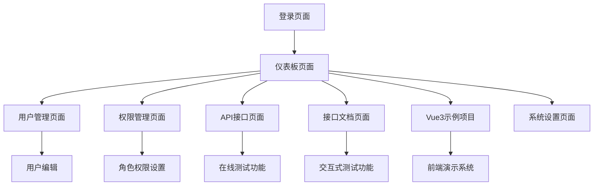

## 1. Product Overview
基于NestJS + TypeScript + TypeORM + Redis + MySQL构建的企业级后端API管理系统，集成Apidoc美观接口文档、内置接口测试功能和Vue3+TDesign示例项目。
- 提供完整的RBAC权限管理系统，支持用户、角色、菜单、权限的精细化管理，配备美观易用的API文档系统和完整的前端示例。
- 支持多种数据库部署方案：远程数据库连接（如192.168.3.227）、免费云数据库服务（PlanetScale、Supabase等）或本地Docker部署。
- 目标是为中小企业提供开箱即用的全栈API管理解决方案，包含后端API和前端示例项目，降低开发成本，提升开发效率。

## 2. Core Features

### 2.1 User Roles
| Role | Registration Method | Core Permissions |
|------|---------------------|------------------|
| 超级管理员 | 系统预设账号 | 拥有所有系统权限，可管理用户、角色、菜单、权限等 |
| 普通管理员 | 超级管理员创建 | 可管理指定模块，查看接口文档和测试 |
| 开发者 | 管理员邀请注册 | 可查看和测试API接口，访问技术文档 |
| 访客用户 | 开放注册 | 只能查看公开的API文档 |

### 2.2 Feature Module
我们的NestJS API管理系统包含以下主要页面：
1. **仪表板页面**：系统概览、统计数据、快速操作入口
2. **用户管理页面**：用户列表、用户信息编辑、角色分配
3. **权限管理页面**：角色管理、菜单管理、权限分配
4. **API接口页面**：接口列表、在线测试、参数配置
5. **接口文档页面**：Apidoc美观文档展示、交互式测试
6. **Vue3示例项目**：基于TDesign的完整前端示例系统
7. **系统设置页面**：系统配置、数据库管理、日志查看

### 2.3 Page Details
| Page Name | Module Name | Feature description |
|-----------|-------------|---------------------|
| 仪表板页面 | 数据统计模块 | 显示用户数量、API调用次数、系统状态等关键指标 |
| 仪表板页面 | 快速操作模块 | 提供常用功能的快速入口，如创建用户、测试API等 |
| 用户管理页面 | 用户列表模块 | 分页展示用户信息，支持搜索、筛选、批量操作 |
| 用户管理页面 | 用户编辑模块 | 创建、编辑、删除用户，设置用户状态和角色 |
| 权限管理页面 | 角色管理模块 | 创建和管理角色，分配权限，设置角色层级关系 |
| 权限管理页面 | 菜单管理模块 | 管理系统菜单结构，设置菜单权限和显示条件 |
| API接口页面 | 接口列表模块 | 展示所有API接口，支持分类、搜索和状态管理 |
| API接口页面 | 在线测试模块 | 内置接口测试工具，支持参数输入、请求发送、响应查看 |
| 接口文档页面 | Apidoc文档模块 | 基于Apidoc的美观API文档，自动生成接口说明和示例 |
| 接口文档页面 | 交互式测试模块 | 在文档中嵌入真实的接口测试功能，实时验证API |
| Vue3示例项目 | 登录认证模块 | 完整的用户登录、注册、密码重置功能演示 |
| Vue3示例项目 | 权限管理模块 | 基于TDesign的用户、角色、权限管理界面 |
| Vue3示例项目 | 数据展示模块 | 表格、图表、表单等组件的实际应用示例 |
| Vue3示例项目 | API调用模块 | 展示如何调用后端API，处理请求和响应数据 |
| 系统设置页面 | 系统配置模块 | 管理系统参数、数据库连接、缓存配置等 |
| 系统设置页面 | 日志管理模块 | 查看系统日志、API调用日志、错误日志等 |
| 登录注册页面 | 用户认证模块 | JWT登录、注册、密码重置、邮箱验证功能 |

## 3. Core Process

**管理员操作流程：**
管理员登录系统后，首先进入仪表板查看系统概况，然后可以进入用户管理创建和管理用户账号，在权限管理中设置角色和权限，通过API接口页面管理和测试接口，最后在系统设置中配置系统参数。

**开发者操作流程：**
开发者登录后可以直接访问API接口页面查看可用接口，使用内置测试工具验证接口功能，同时可以访问Apidoc文档页面查看详细的API使用说明和进行交互式测试，还可以通过Vue3示例项目查看实际的前端集成效果。

**访客用户流程：**
访客用户可以直接访问公开的接口文档页面，查看API说明和示例，同时可以体验Vue3示例项目的演示功能。



## 4. User Interface Design

### 4.1 Design Style
- **主色调**：#1890ff（蓝色）作为主色，#52c41a（绿色）作为成功色，#f5222d（红色）作为警告色
- **按钮样式**：圆角按钮设计，支持多种尺寸，hover效果明显
- **字体**：系统默认字体，标题使用16-20px，正文使用14px，小字使用12px
- **布局风格**：左侧导航 + 顶部面包屑的经典后台布局，卡片式内容展示
- **图标风格**：使用Ant Design图标库，简洁现代的线性图标风格

### 4.2 Page Design Overview

| Page Name | Module Name | UI Elements |
|-----------|-------------|-------------|
| 仪表板页面 | 数据统计模块 | 使用卡片布局展示统计数据，配色为浅蓝色背景#f0f9ff，数字使用大号字体24px |
| 仪表板页面 | 快速操作模块 | 网格布局的操作按钮，每个按钮包含图标和文字，hover时有阴影效果 |
| 用户管理页面 | 用户列表模块 | 表格布局，斑马纹行样式，操作列使用按钮组，支持分页和搜索框 |
| API接口页面 | 在线测试模块 | 左右分栏布局，左侧参数输入区，右侧响应展示区，使用代码高亮显示 |
| 接口文档页面 | Apidoc文档模块 | 现代化设计，深色主题可选，左侧API分类导航，右侧详细文档和测试区域 |
| Vue3示例项目 | TDesign界面 | 基于TDesign Vue Next组件库，蓝色主题#0052d9，卡片式布局，响应式设计 |
| 登录注册页面 | 用户认证模块 | 居中卡片布局，渐变背景，表单使用圆角输入框，主按钮使用品牌色 |

### 4.3 Responsiveness
系统采用桌面优先的响应式设计，在移动端进行适配优化，支持触摸操作，确保在平板和手机上也能正常使用核心功能。Vue3示例项目完全响应式，适配各种屏幕尺寸。

## 5. 数据库配置方案

### 5.1 远程数据库连接
- **MySQL连接**：192.168.3.227:3306，支持现有数据库复用
- **Redis连接**：192.168.3.227:6379，用于缓存和会话管理
- **环境配置**：通过.env文件配置远程数据库连接参数

### 5.2 免费云数据库服务
- **PlanetScale**：免费MySQL兼容数据库，支持分支和无服务器架构
- **Supabase**：开源Firebase替代品，提供PostgreSQL数据库和实时功能
- **Railway**：提供免费的PostgreSQL和Redis服务
- **Aiven**：提供免费的MySQL和Redis服务（有使用限制）

### 5.3 本地Docker部署
- **Docker Compose**：一键启动MySQL和Redis服务
- **数据持久化**：配置数据卷确保数据安全
- **开发环境**：支持热重载和调试模式

## 6. API接口规范

### 5.1 认证授权接口
| 接口名称 | 请求方法 | 路径 | 功能描述 |
|---------|---------|------|----------|
| 用户登录 | POST | /auth/login | 用户名密码登录，返回JWT token |
| 用户注册 | POST | /auth/register | 新用户注册，支持邮箱验证 |
| 刷新Token | POST | /auth/refresh | 刷新访问令牌 |
| 用户登出 | POST | /auth/logout | 用户登出，清除token |
| 密码重置 | POST | /auth/reset-password | 通过邮箱重置密码 |
| 获取用户信息 | GET | /auth/profile | 获取当前登录用户信息 |

### 5.2 用户管理接口
| 接口名称 | 请求方法 | 路径 | 功能描述 |
|---------|---------|------|----------|
| 用户列表 | GET | /users | 分页获取用户列表，支持搜索筛选 |
| 创建用户 | POST | /users | 管理员创建新用户 |
| 用户详情 | GET | /users/:id | 获取指定用户详细信息 |
| 更新用户 | PUT | /users/:id | 更新用户信息 |
| 删除用户 | DELETE | /users/:id | 删除指定用户 |
| 用户状态切换 | PATCH | /users/:id/status | 启用/禁用用户账号 |

### 5.3 角色权限接口
| 接口名称 | 请求方法 | 路径 | 功能描述 |
|---------|---------|------|----------|
| 角色列表 | GET | /roles | 获取所有角色列表 |
| 创建角色 | POST | /roles | 创建新角色 |
| 角色详情 | GET | /roles/:id | 获取角色详细信息 |
| 更新角色 | PUT | /roles/:id | 更新角色信息 |
| 删除角色 | DELETE | /roles/:id | 删除角色 |
| 权限列表 | GET | /permissions | 获取所有权限列表 |
| 角色权限分配 | POST | /roles/:id/permissions | 为角色分配权限 |
| 用户角色分配 | POST | /users/:id/roles | 为用户分配角色 |

### 5.4 菜单管理接口
| 接口名称 | 请求方法 | 路径 | 功能描述 |
|---------|---------|------|----------|
| 菜单树 | GET | /menus/tree | 获取菜单树结构 |
| 菜单列表 | GET | /menus | 获取菜单列表 |
| 创建菜单 | POST | /menus | 创建新菜单项 |
| 更新菜单 | PUT | /menus/:id | 更新菜单信息 |
| 删除菜单 | DELETE | /menus/:id | 删除菜单项 |
| 用户菜单 | GET | /menus/user | 获取当前用户可访问的菜单 |

### 5.5 系统管理接口
| 接口名称 | 请求方法 | 路径 | 功能描述 |
|---------|---------|------|----------|
| 系统统计 | GET | /system/stats | 获取系统统计数据 |
| 系统配置 | GET | /system/config | 获取系统配置信息 |
| 更新配置 | PUT | /system/config | 更新系统配置 |
| 操作日志 | GET | /system/logs | 获取系统操作日志 |
| 清理日志 | DELETE | /system/logs | 清理历史日志 |
| 数据备份 | POST | /system/backup | 创建数据备份 |
| 健康检查 | GET | /health | 系统健康状态检查 |

## 7. Vue3+TDesign示例项目

### 7.1 技术栈
- **前端框架**：Vue 3.4+ (Composition API)
- **UI组件库**：TDesign Vue Next
- **状态管理**：Pinia
- **路由管理**：Vue Router 4
- **HTTP客户端**：Axios
- **构建工具**：Vite 5+
- **类型检查**：TypeScript 5+
- **代码规范**：ESLint + Prettier

### 7.2 项目结构
```
frontend/
├── src/
│   ├── components/     # 公共组件
│   ├── views/          # 页面组件
│   ├── stores/         # Pinia状态管理
│   ├── api/            # API接口封装
│   ├── utils/          # 工具函数
│   ├── types/          # TypeScript类型定义
│   ├── router/         # 路由配置
│   └── assets/         # 静态资源
├── public/             # 公共资源
└── package.json        # 依赖配置
```

### 7.3 核心功能页面
1. **登录注册页面**：用户认证、密码重置、记住登录状态
2. **仪表板页面**：数据统计、快速操作、系统概览
3. **用户管理页面**：用户列表、添加编辑、角色分配、批量操作
4. **角色管理页面**：角色创建、权限分配、角色层级管理
5. **权限管理页面**：菜单管理、权限树、动态路由
6. **API测试页面**：接口列表、在线测试、历史记录
7. **系统设置页面**：个人设置、主题切换、系统配置

### 7.4 组件设计规范
- **表格组件**：支持分页、排序、筛选、批量操作
- **表单组件**：统一验证、错误提示、自动保存
- **权限组件**：按钮级权限控制、路由守卫
- **布局组件**：响应式侧边栏、面包屑导航
- **图表组件**：基于ECharts的数据可视化

### 7.5 API集成示例
每个功能模块都包含完整的API调用示例，展示：
- 请求参数构造
- 响应数据处理
- 错误处理机制
- 加载状态管理
- 数据缓存策略